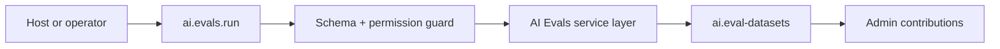

# AI Evals Developer Guide

Eval datasets, judges, regression baselines, and release-grade AI review.

**Maturity Tier:** `Hardened`

## Purpose And Architecture Role

Owns evaluation datasets, judges, regression baselines, and the release-review evidence used to keep AI changes honest.

### This plugin is the right fit when

- You need **eval datasets**, **release gating**, **baseline regression review** as a governed domain boundary.
- You want to integrate through declared actions, resources, jobs, workflows, and UI surfaces instead of implicit side effects.
- You need the host application to keep plugin boundaries honest through manifest capabilities, permissions, and verification lanes.

### This plugin is intentionally not

- Not an everything-and-the-kitchen-sink provider abstraction layer.
- Not a substitute for explicit approval, budgeting, and audit governance in the surrounding platform.

## Repo Map

| Path | Purpose |
| --- | --- |
| `package.json` | Root extracted-repo manifest, workspace wiring, and repo-level script entrypoints. |
| `framework/builtin-plugins/ai-evals` | Nested publishable plugin package. |
| `framework/builtin-plugins/ai-evals/src` | Runtime source, actions, resources, services, and UI exports. |
| `framework/builtin-plugins/ai-evals/tests` | Unit, contract, integration, and migration coverage where present. |
| `framework/builtin-plugins/ai-evals/docs` | Internal domain-doc source set kept in sync with this guide. |
| `framework/builtin-plugins/ai-evals/db/schema.ts` | Database schema contract when durable state is owned. |
| `framework/builtin-plugins/ai-evals/src/postgres.ts` | SQL migration and rollback helpers when exported. |

## Manifest Contract

| Field | Value |
| --- | --- |
| Package Name | `@plugins/ai-evals` |
| Manifest ID | `ai-evals` |
| Display Name | AI Evals |
| Version | `0.1.0` |
| Kind | `ai-pack` |
| Trust Tier | `first-party` |
| Review Tier | `R1` |
| Isolation Profile | `same-process-trusted` |
| Framework Compatibility | ^0.1.0 |
| Runtime Compatibility | bun>=1.3.12 |
| Database Compatibility | postgres, sqlite |

## Dependency Graph And Capability Requests

| Field | Value |
| --- | --- |
| Depends On | `ai-core`, `audit-core`, `jobs-core` |
| Requested Capabilities | `ui.register.admin`, `api.rest.mount`, `data.write.ai`, `jobs.execute.ai` |
| Provides Capabilities | `ai.evals`, `ai.release-gates` |
| Owns Data | `ai.eval-datasets`, `ai.eval-runs` |

### Dependency interpretation

- Direct plugin dependencies describe package-level coupling that must already be present in the host graph.
- Requested capabilities tell the host what platform services or sibling plugins this package expects to find.
- Provided capabilities and owned data tell integrators what this package is authoritative for.

## Public Integration Surfaces

| Type | ID / Symbol | Access / Mode | Notes |
| --- | --- | --- | --- |
| Action | `ai.evals.run` | Permission: `ai.evals.run` | Non-idempotent<br>Audited |
| Action | `ai.evals.compare` | Permission: `ai.evals.read` | Idempotent |
| Action | `ai.evals.capture-baseline` | Permission: `ai.evals.capture-baseline` | Non-idempotent<br>Audited |
| Action | `ai.evals.promote-release` | Permission: `ai.evals.promote` | Non-idempotent<br>Audited |
| Resource | `ai.eval-datasets` | Portal disabled | Admin auto-CRUD enabled<br>Fields: `label`, `caseCount`, `updatedAt` |
| Resource | `ai.eval-runs` | Portal disabled | Admin auto-CRUD enabled<br>Fields: `datasetId`, `status`, `passRate`, `averageScore`, `completedAt` |
| Resource | `ai.eval-baselines` | Portal disabled | Admin auto-CRUD enabled<br>Fields: `subjectKind`, `subjectId`, `lineageParentId`, `releaseChannel`, `capturedAt` |
| Resource | `ai.eval-release-gates` | Portal disabled | Admin auto-CRUD enabled<br>Fields: `subjectKind`, `subjectId`, `status`, `candidateRunId`, `promotedAt` |


### UI Surface Summary

| Surface | Present | Notes |
| --- | --- | --- |
| UI Surface | Yes | A bounded UI surface export is present. |
| Admin Contributions | Yes | Additional admin workspace contributions are exported. |
| Zone/Canvas Extension | No | No dedicated zone extension export. |

## Hooks, Events, And Orchestration

This plugin should be integrated through **explicit commands/actions, resources, jobs, workflows, and the surrounding Gutu event runtime**. It must **not** be documented as a generic WordPress-style hook system unless such a hook API is explicitly exported.

- No standalone plugin-owned lifecycle event feed is exported today.
- No plugin-owned job catalog is exported today.
- No plugin-owned workflow catalog is exported today.
- Recommended composition pattern: invoke actions, read resources, then feed release-gate and baseline decisions into the surrounding AI and company-pack rollout runtime.

## Storage, Schema, And Migration Notes

- Database compatibility: `postgres`, `sqlite`
- Schema file: `framework/builtin-plugins/ai-evals/db/schema.ts`
- SQL helper file: `framework/builtin-plugins/ai-evals/src/postgres.ts`
- Migration lane present: No

The plugin does not export a dedicated SQL helper module today. Treat the schema and resources as the durable contract instead of inventing undocumented SQL behavior.

## Failure Modes And Recovery

- Action inputs can fail schema validation or permission evaluation before any durable mutation happens.
- If downstream automation is needed, the host must add it explicitly instead of assuming this plugin emits jobs.
- Gate promotion should fail closed when replay-linked comparisons or baseline lineage are missing.
- There is no separate lifecycle-event feed to rely on today; do not build one implicitly from internal details.
- Schema-affecting changes need extra care because there is no dedicated migration lane yet.

## Mermaid Flows

### Primary Lifecycle




## Integration Recipes

### 1. Host wiring

```ts
import { manifest, runEvalDatasetAction, EvalDatasetResource, adminContributions, uiSurface } from "@plugins/ai-evals";

export const pluginSurface = {
  manifest,
  runEvalDatasetAction,
  EvalDatasetResource,
  
  
  adminContributions,
  uiSurface
};
```

Use this pattern when your host needs to register the plugin’s declared exports without reaching into internal file paths.

### 2. Action-first orchestration

```ts
import { manifest, runEvalDatasetAction } from "@plugins/ai-evals";

console.log("plugin", manifest.id);
console.log("action", runEvalDatasetAction.id);
```

- Prefer action IDs as the stable integration boundary.
- Respect the declared permission, idempotency, and audit metadata instead of bypassing the service layer.
- Treat resource IDs as the read-model boundary for downstream consumers.

### 3. Cross-plugin composition

- Compose this plugin through action invocations and resource reads.
- If downstream automation becomes necessary, add it in the surrounding Gutu command/event/job runtime instead of assuming this plugin already exports a hook surface.

## Test Matrix

| Lane | Present | Evidence |
| --- | --- | --- |
| Build | Yes | `bun run build` |
| Typecheck | Yes | `bun run typecheck` |
| Lint | Yes | `bun run lint` |
| Test | Yes | `bun run test` |
| Unit | Yes | 2 file(s) |
| Contracts | Yes | 1 file(s) |
| Integration | Yes | 1 file(s) |
| Migrations | Yes | 1 file(s) |

### Verification commands

- `bun run build`
- `bun run typecheck`
- `bun run lint`
- `bun run test`
- `bun run test:contracts`
- `bun run test:integration`
- `bun run test:migrations`
- `bun run test:unit`
- `bun run docs:check`

## Current Truth And Recommended Next

### Current truth

- Exports 4 governed actions: `ai.evals.run`, `ai.evals.compare`, `ai.evals.capture-baseline`, `ai.evals.promote-release`.
- Owns 4 resource contracts: `ai.eval-datasets`, `ai.eval-runs`, `ai.eval-baselines`, `ai.eval-release-gates`.
- Adds richer admin workspace contributions on top of the base UI surface with replay-linked release-gate visibility.
- Defines a durable data schema contract even though no explicit SQL helper module is exported.

### Current gaps

- Cross-repo workspace bootstrap is still required before the package can run end-to-end verification lanes in isolation.
- The repo validates schema shape and governed release-gate behavior, but it still does not emit first-party SQL migration files from this package.
- Judge provenance and dataset lineage are still intentionally thin while the hardened gate model settles.

### Recommended next

- Add emitted SQL migration assets and rollback helpers alongside the current schema-verification lane.
- Broaden the integration matrix beyond the current company-pack release gate and replay-linked promotion flow.
- Wire the current evaluation evidence into more release and rollout control points.
- Add richer judge provenance and dataset lineage as the eval corpus grows.
- Promote important downstream reactions into explicit commands, jobs, or workflow steps instead of relying on implicit coupling.

### Later / optional

- Domain-specific judge packs and cross-environment benchmark promotion.
- More connector breadth, richer evaluation libraries, and domain-specific copilots after the baseline contracts settle.
